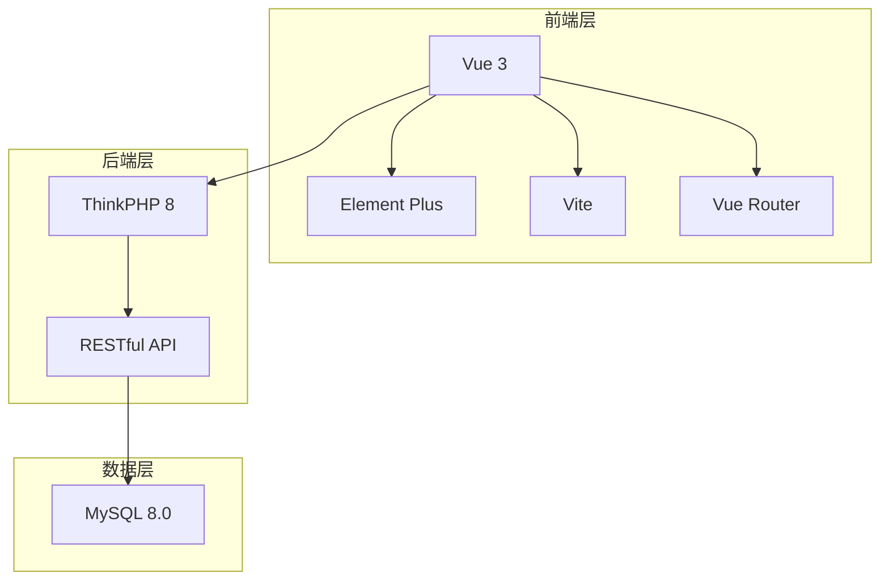
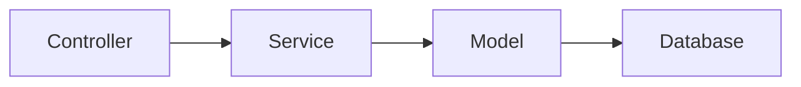
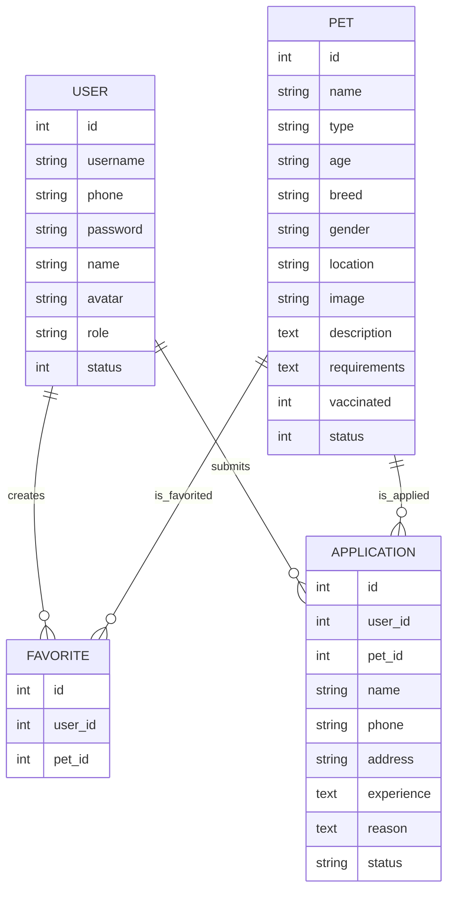

## 1. Architecture Design


## 2. Technology Description
- 前端：Vue 3 + Element Plus + Vite
- 后端：ThinkPHP 8
- 数据库：MySQL 8.0
- 路由：Vue Router
- 状态管理：Vue 响应式系统

## 3. Route Definitions
| Route | Purpose |
|-------|---------|
| / | 首页 |
| /pets | 宠物列表 |
| /pet/:id | 宠物详情 |
| /login | 登录 |
| /register | 注册 |
| /profile | 个人中心 |
| /favorites | 收藏列表 |
| /applications | 申请列表 |

## 4. API Definitions
```typescript
// 用户类型定义
interface User {
  id: number;
  username: string;
  phone?: string;
  name?: string;
  role: 'user' | 'admin';
  status: number;
}

interface Pet {
  id: number;
  name: string;
  type: 'dog' | 'cat' | 'other';
  age?: string;
  breed?: string;
  gender?: 'male' | 'female';
  location?: string;
  image?: string;
  description?: string;
  requirements?: string;
  vaccinated?: number;
  status?: number;
}

// 登录请求
interface LoginRequest {
  username: string;
  password: string;
}

// 登录响应
interface LoginResponse {
  code: number;
  msg: string;
  data: {
    token: string;
    user: User;
  };
}
```

## 5. Server Architecture Diagram


## 6. Data Model
### 6.1 Data Model Definition


### 6.2 Data Definition Language
```sql
-- 用户表
CREATE TABLE chongai_user (
    id INT AUTO_INCREMENT PRIMARY KEY,
    username VARCHAR(50) NOT NULL UNIQUE,
    phone VARCHAR(11),
    password VARCHAR(255) NOT NULL,
    name VARCHAR(50),
    avatar VARCHAR(255),
    role ENUM('user', 'admin') DEFAULT 'user',
    status TINYINT DEFAULT 1,
    created_at TIMESTAMP DEFAULT CURRENT_TIMESTAMP,
    updated_at TIMESTAMP DEFAULT CURRENT_TIMESTAMP ON UPDATE CURRENT_TIMESTAMP
);

-- 宠物表
CREATE TABLE chongai_pet (
    id INT AUTO_INCREMENT PRIMARY KEY,
    name VARCHAR(50) NOT NULL,
    type ENUM('dog', 'cat', 'other') NOT NULL,
    age VARCHAR(20),
    breed VARCHAR(50),
    gender ENUM('male', 'female'),
    location VARCHAR(100),
    image VARCHAR(255),
    description TEXT,
    requirements TEXT,
    vaccinated TINYINT DEFAULT 0,
    neutered TINYINT DEFAULT 0,
    status TINYINT DEFAULT 1,
    view_count INT DEFAULT 0,
    created_at TIMESTAMP DEFAULT CURRENT_TIMESTAMP,
    updated_at TIMESTAMP DEFAULT CURRENT_TIMESTAMP ON UPDATE CURRENT_TIMESTAMP
);

-- 收藏表
CREATE TABLE chongai_favorite (
    id INT AUTO_INCREMENT PRIMARY KEY,
    user_id INT NOT NULL,
    pet_id INT NOT NULL,
    UNIQUE KEY (user_id, pet_id),
    created_at TIMESTAMP DEFAULT CURRENT_TIMESTAMP
);

-- 领养申请表
CREATE TABLE chongai_application (
    id INT AUTO_INCREMENT PRIMARY KEY,
    user_id INT NOT NULL,
    pet_id INT NOT NULL,
    name VARCHAR(50) NOT NULL,
    phone VARCHAR(20) NOT NULL,
    address VARCHAR(200) NOT NULL,
    experience TEXT,
    reason TEXT,
    status ENUM('pending', 'approved', 'rejected') DEFAULT 'pending',
    created_at TIMESTAMP DEFAULT CURRENT_TIMESTAMP,
    updated_at TIMESTAMP DEFAULT CURRENT_TIMESTAMP ON UPDATE CURRENT_TIMESTAMP
);
```
